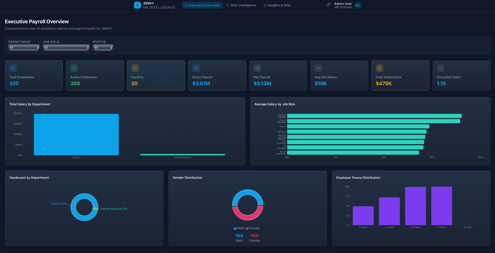
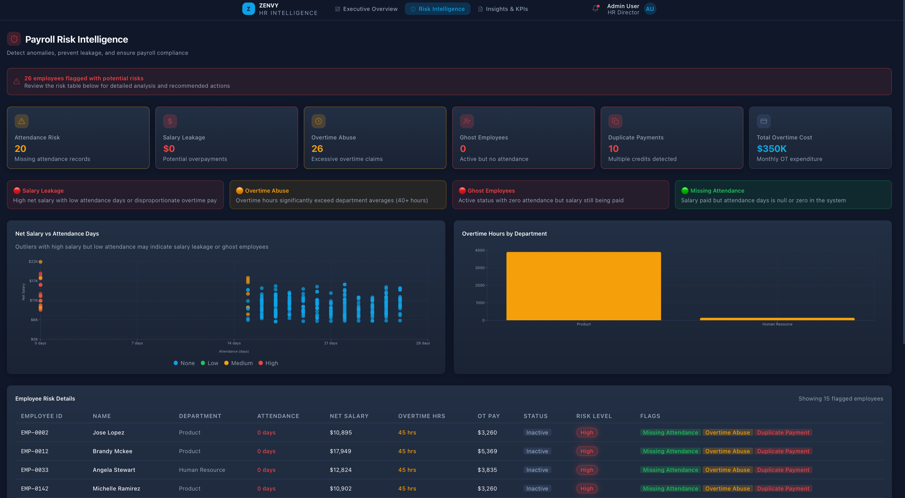
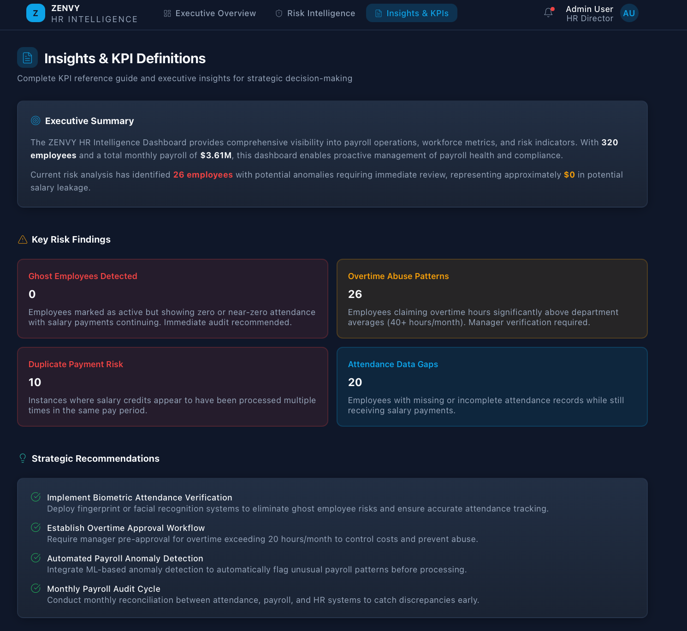
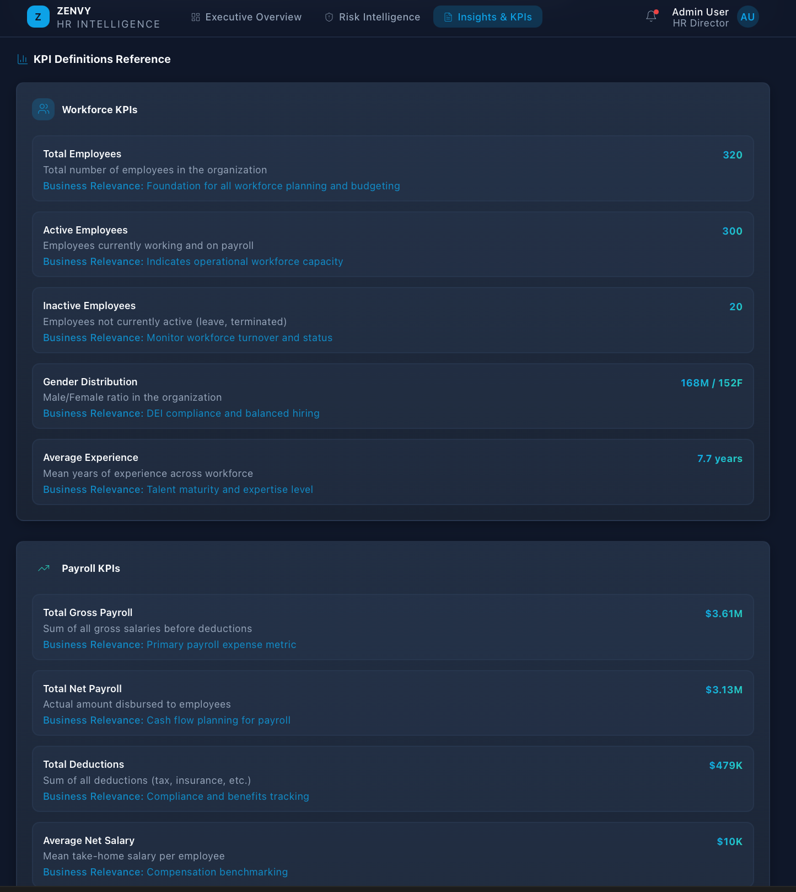
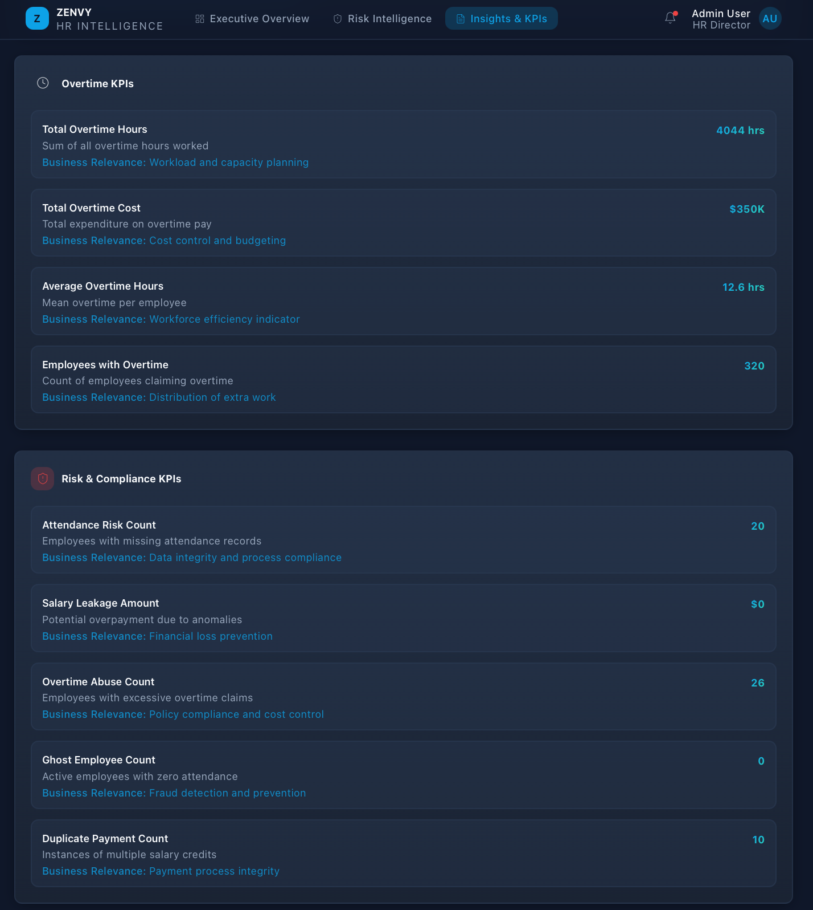

# ZENVY — AI Powered HR & Payroll Intelligence Dashboard

Version: Internship sample deliverable  
Author: Neha06-tech  
Date: 2026-01-03

---

## Project summary
Executive-focused payroll intelligence built from `zenvy_hr_payroll_data.csv`. Converts employee-level HR data into a two-page Power BI dashboard that surfaces payroll spend, workforce composition and prioritized payroll risks (salary leakage, overtime abuse, ghost payments, missing attendance, duplicate credits).

---

## Dataset (baseline)
Columns in source CSV: First/Last Name, Email, Gender, Age, Job Title, Years Of Experience, Salary (monthly), Department. Payroll/time fields are derived or simulated for analytics.

---

## Derived payroll fields (brief)
- Payroll_Date (monthly), PayPeriod
- Employee_Status (Active/Inactive)
- Attendance_Days (simulated, default 22 workdays)
- Overtime_Hours, Overtime_Pay (hourly rate = Salary/176; overtime multiplier default 1.5)
- Gross_Salary = BaseSalary + Overtime_Pay
- Deductions (simulated % by salary band)
- Net_Salary = Gross_Salary - Deductions
- PaymentReference, IsDuplicatePayment
Parameters (workdays, overtime cap, deduction bands) are configurable.

---

## Key KPIs (high level)
Workforce: Total Employees, Active Employees, Avg Tenure, Avg Attendance.  
Payroll: Total Gross Payroll, Total Net Payroll, Total Deductions, Avg Net Salary.  
Overtime: Total Overtime Hours, Total Overtime Cost, Overtime Abuse Count.  
Risk: Salary Leakage Amount & Count, Ghost Employee Count, Missing Attendance Count, Duplicate Payment Count, Payroll Risk Score.

---

## Risk detection (summary)
- Salary leakage: flag employees with Net_Salary per attendance day > 1.5× peer median (Department+Job) after excluding legitimate overtime.
- Overtime abuse: flag Overtime_Hours > policy (e.g., 40 hrs) or >1.5× department median; prioritize by Overtime_Pay.
- Ghost employees: Active employees with Attendance_Days = 0 (especially repeated months) but receiving pay.
- Missing attendance & duplicate credits detected per pay-period and payment reference.

---

## Dashboard structure
Page 1 — Executive Payroll Overview: KPI cards, payroll trend, headcount by department/location, salary distribution, top risk summary.  
Page 2 — Payroll Risk & Intelligence: risk KPIs, ranked employee risk table, adjustable detection thresholds, investigation/exportable table, case tracker.

---

## Next steps (recommended)
- Generate a FactPayroll CSV (script available) to populate Payroll rows.  
- Implement DAX measures and parameter slicers.  
- Add an investigation log and monthly executive scorecard.

## Dashboard Preview
## EXECUTIVE PAYROLL OVERALL

## PAYROLL RISK INTELLIENCE

## INSIGHTS AND KPI DEFINITIONS

## KPI DEFINITION REFERRENCE

## OVERTIME KPI'S

